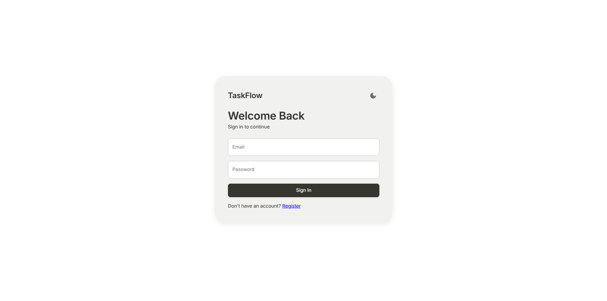
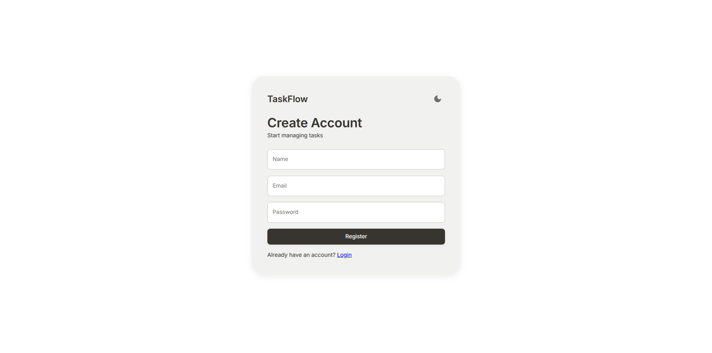
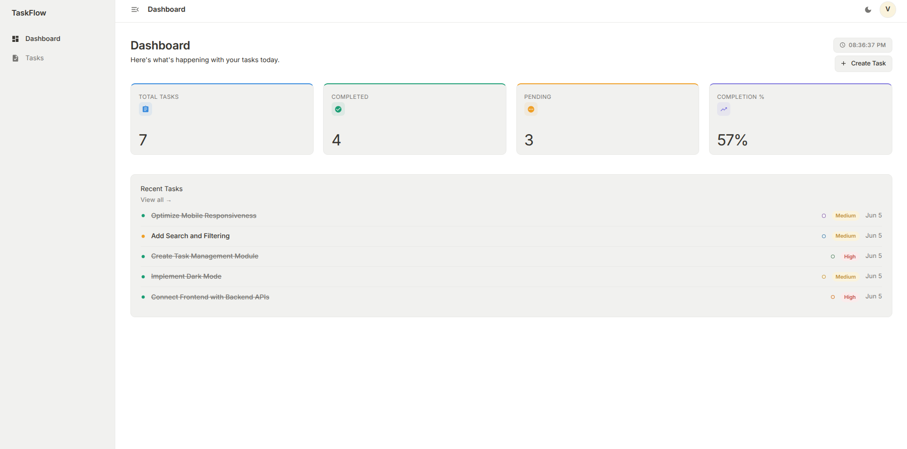
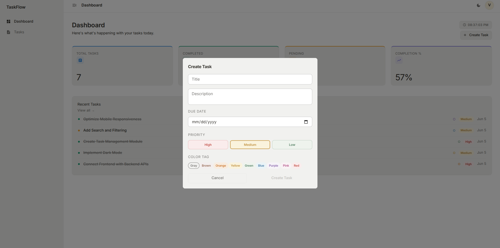
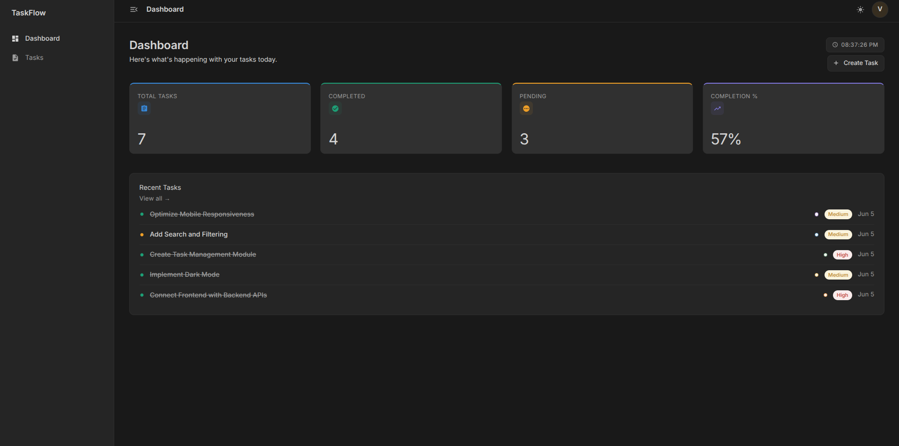
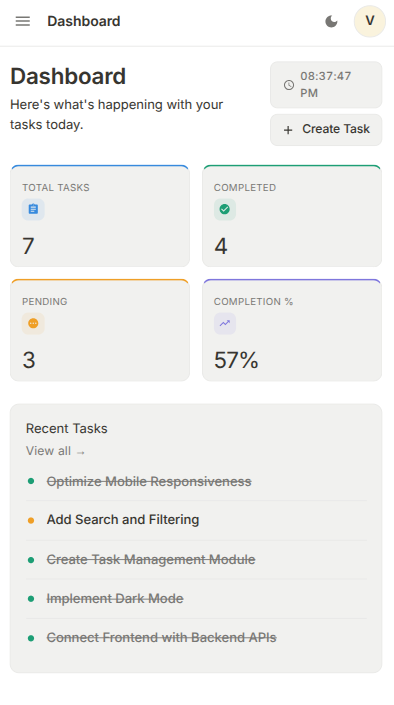

# TaskFlow – Smart Task Management System

TaskFlow is a full-stack task management application built using the MERN Stack (MongoDB, Express.js, React.js, and Node.js). The platform enables users to securely manage tasks, track productivity, and monitor task completion through a modern and responsive dashboard.

The application incorporates JWT-based authentication, protected routes, real-time task statistics, dark/light theme support, and a clean user experience designed for productivity.

---

## 🚀 Live Demo
**https://avquint-innovations-mern-project.vercel.app/login**

**Project Demonstration Video:**  
[YouTube / Drive Video Link]

---

## ✨ Features

### Authentication & Security
- User Registration
- User Login
- JWT Authentication
- Protected Routes
- Password Encryption using bcrypt

### Task Management
- Create Tasks
- View Tasks
- Update Tasks
- Delete Tasks
- Pagination
- Search & Filtering
- Mark Tasks as Completed

### Dashboard Analytics
- Total Tasks Count
- Completed Tasks Count
- Pending Tasks Count
- Completion Percentage

### User Experience
- Responsive Design
- Dark & Light Themes
- Toast Notifications
- Material UI Components

---

### Login Page

Secure authentication interface for registered users.



---

### Registration Page

New users can create an account and start managing tasks.



---

### Dashboard Overview

Displays task statistics, productivity insights, and quick actions.



---

### Task Management

Users can create, edit, complete, and delete tasks.



---

### Dark Mode Interface

Modern dark theme designed for comfortable viewing during extended usage.



---

### Mobile Responsive View

Fully responsive layout optimized for smaller devices.



---

## 🛠️ Technology Stack

### Frontend
- React.js
- Vite
- Material UI
- React Router DOM
- Axios

### Backend
- Node.js
- Express.js
- JWT Authentication
- Express Validator
- bcrypt.js

### Database
- MongoDB Atlas
- Mongoose ODM

### Deployment
- Vercel (Frontend)
- Render (Backend)

---

## 🔄 Project Workflow

1. User registers or logs into the application.
2. Backend validates credentials and generates a JWT token.
3. Token is stored on the client side for authenticated requests.
4. Users can perform CRUD operations on tasks.
5. Dashboard statistics are dynamically generated from task data.
6. Protected routes ensure only authenticated users can access their data.

---

## 📡 API Endpoints

### Authentication

| Method | Endpoint | Description |
|----------|------------|------------|
| POST | `/api/auth/register` | Register a new user |
| POST | `/api/auth/login` | Login user |
| GET | `/api/auth/profile` | Get logged-in user profile |

### Tasks

| Method | Endpoint | Description |
|----------|------------|------------|
| POST | `/api/tasks` | Create task |
| GET | `/api/tasks` | Get all tasks |
| PUT | `/api/tasks/:id` | Update task |
| DELETE | `/api/tasks/:id` | Delete task |

### Dashboard

| Method | Endpoint | Description |
|----------|------------|------------|
| GET | `/api/dashboard` | Get dashboard statistics |

---

## ⚙️ Local Setup

### Clone Repository

```bash
git clone <repository-url>
cd <project-folder>
```

### Backend Setup

```bash
cd backend
npm install
npm run dev
```

Create a `.env` file inside the backend folder:

```env
PORT=5000
MONGO_URI=YOUR_MONGODB_URI
JWT_SECRET=YOUR_SECRET_KEY
JWT_EXPIRE=7d
CLIENT_URL=http://localhost:5173
```

### Frontend Setup

```bash
cd frontend
npm install
npm run dev
```

Create a `.env` file inside the frontend folder:

```env
VITE_API_URL=http://localhost:5000/api
```

---

## 📂 Folder Structure

```text
TaskFlow
│
├── frontend
│   ├── public
│   ├── src
│   │   ├── api
│   │   ├── assets
│   │   ├── components
│   │   ├── pages
│   │   ├── layouts
│   │   ├── services
│   │   ├── context
│   │   ├── theme
│   │   └── routes
│   │
│   └── package.json
│
├── backend
│   ├── src
│   │   ├── config
│   │   ├── controllers
│   │   ├── middleware
│   │   ├── models
│   │   ├── routes
│   │   ├── validators
│   │   └── utils
│   │
│   └── package.json
│
└── README.md
```